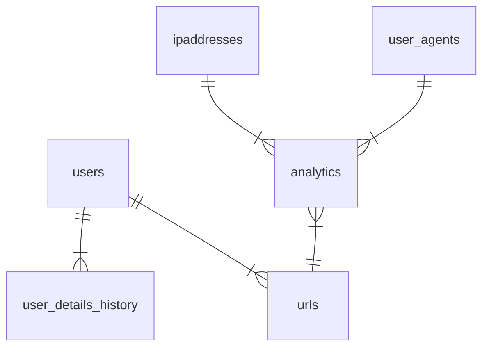

# urlshortner-expressjs-api

Develop URL shortener with KPI integration. Create concise links for large URLs, addressing customer needs for efficient redirection and tracking performance.

## Features

- [x] generate shorturl for a longurl
- [x] redirect from shoturl to a longurl
- [x] track the details of the users ipaddress, browser, os who visited the shorturls
- [x] create user
- [x] track changes to the user details
- [x] show analytics of each url
- [ ] show analytics of a user's

## ER Diagram



## Setup

> [!important]
>
> - rename the index.js.example file to index.js in config folder.
> - make necessary changes to the index.js file inside config folder.
> - create a database using the schema file

### Install Dependencies

- npm install

### Start Server

- node app.js

### Sample Front End
> [!note]
> Example frontend based on this api : [React urlshortner Frontend](https://github.com/ultra-hash/ulrshortner-frontend)

## End Points

Current implementation

- Get detailed stats of short url
  - `GET /url/details/:shortUrl/stats`
  - response
    ```json
    {
      "totalVisits": 6,
      "shortUrl": "fJ7OUJTH",
      "longUrl": "https://www.ultrahash.in",
      "userAgentsAndVisits": {
        "Mozilla/5.0 (Windows NT 10.0; Win64; x64; rv:x1.0) Gecko/20100101 Firefox/x01.0": 2,
        "PostmanRuntime/7.33.0": 2,
        "Mozilla/5.0 (Windows NT 10.0; Win64; x64) AppleWebKit/2xx.21 (KHTML, like Gecko) Chrome/1xx.3.44.2 Safari/2xx.21": 2
      },
      "ipAddressAndVisits": {
        "::ffff:127.0.0.1": 2,
        "::ffff:192.168.78.112": 4
      },
      "activityTimeAndVisits": {
        "18:00 - 19:00": 3,
        "23:00 - 0:00": 1,
        "19:00 - 20:00": 2
      }
    }
    ```
- List all users
  - `GET /user/list`
  - response
    ```json
    [
     {
       "id": 1,
       "first_name": "John",
       "last_name": "Doe",
       "phone_number": 123456789,
       "email_id": "john.doe@example.com",
       "username": "johndoe",
       "hashed_password": "$2b$10$9dXhFPKkslaaszaavbBvPnuLszSd74TdREgsVVUZcudZEkiapimRIFRW",
       "created_at": "2023-09-28T18:10:48.000Z"
     },
     ...
    ]
    ```
- Create new user
  - `POST /user/create`
  - request body
    ```json
    {
      "firstName": "John",
      "lastName": "Cena",
      "username": "johncena",
      "emailId": "john.cena@example.com",
      "password": "password_1",
      "phoneNumber": "1234567890"
    }
    ```
  - response
    ```json
    {
      "fieldCount": 0,
      "affectedRows": 1,
      "insertId": 23,
      "info": "",
      "serverStatus": 2,
      "warningStatus": 0,
      "changedRows": 0
    }
    ```
- Get user details by query parameter (id, email, username, phoneNumber)
  - `GET /user/details?email="john.cena@example.com"`
  - response
    ```json
    {
      "id": 23,
      "first_name": "John",
      "last_name": "Cena",
      "phone_number": 1234567890,
      "email_id": "john.cena@example.com",
      "username": "johncena",
      "hashed_password": "$2b$10$9dXhFPKkslaaszaavbBvPnuLszSd74TdREgsVVUZcudZEkiapimRIFRW",
      "created_at": "2023-10-21T16:26:59.000Z"
    }
    ```
- Create shortUrl for long url
  - `POST /url/create`
  - request body
    ```json
    {
      "userId": 23,
      "longUrl": "https://ultrahash.in"
    }
    ```
  - response
    ```json
    {
      "id": 26,
      "user_id": 22,
      "short_url": "Z2t5c7sn",
      "long_url": "https://ultrahash.in",
      "created_at": "2023-10-20T10:54:04.000Z"
    }
    ```
- Redirect to LongUrl using shortUrl
  - `GET /url/redirect/:shortUrl`
- Get details of short url
  - `GET /url/details/:shortUrl`
  - response
    ```json
    {
      "id": 26,
      "user_id": 22,
      "short_url": "Z2t5c7sn",
      "long_url": "https://ultrahash.in",
      "created_at": "2023-10-20T10:54:04.000Z"
    }
    ```
