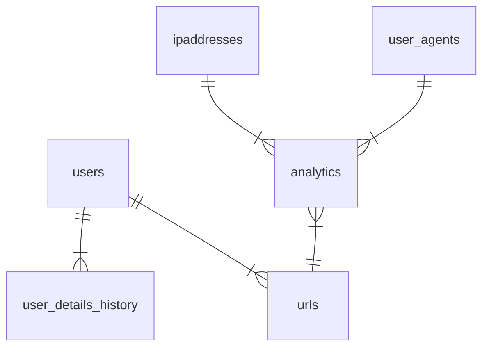

# urlshortner-expressjs-api

Develop URL shortener with KPI integration. Create concise links for large URLs, addressing customer needs for efficient redirection and tracking performance.

### Building and running the application

> [!important]
>
> - rename the .env.example file to .env in config folder.
> - make necessary changes to the .env file.

- ## Containerize using Docker

  When you're ready, start your application by running:
  `docker compose up -d --build`.

- ## Manual Setup

  Setting up database tables in MySQL by executing `schema.sql` script againt your MySQL server

  - ```bash
    mysql -u {db_username} -p {db_password} < schema.sql
    ```

  Install Dependencies

  - ```bash
    npm install
    ```

  Start Server

  - ```bash
    node app.js
    ```

Your application will be available at http://localhost:3000.

## Features

- [x] generate shorturl for a longurl
- [x] redirect from shoturl to a longurl
- [x] track the details of the users ipaddress, browser, os who visited the shorturls
- [x] create user
- [x] track changes to the user details
- [x] show analytics of each url
- [ ] show analytics of a user's

## Entity Relations Diagram



### Sample Front End

> [!note]
> Example frontend based on this api : [React urlshortner Frontend](https://github.com/ultra-hash/ulrshortner-frontend)

> [!important]
>
> # Docs

- ### Get Detailed Stats of Short URL

  Retrieves detailed statistics for a given short URL.

  <details open>
      <summary>show docs</summary>

  ### Endpoint

  - `GET /url/details/:shortUrl/stats`

  #### Parameters

  - `:shortUrl` (path parameter): The short URL identifier.

  #### Response

  ```json
  {
    "totalVisits": 6,
    "shortUrl": "fJ7OUJTH",
    "longUrl": "https://www.ultrahash.in",
    "userAgentsAndVisits": {
      "Mozilla/5.0 (Windows NT 10.0; Win64; x64; rv:x1.0) Gecko/20100101 Firefox/x01.0": 2,
      "PostmanRuntime/7.33.0": 2,
      "Mozilla/5.0 (Windows NT 10.0; Win64; x64) AppleWebKit/2xx.21 (KHTML, like Gecko) Chrome/1xx.3.44.2 Safari/2xx.21": 2
    },
    "ipAddressAndVisits": {
      "::ffff:127.0.0.1": 2,
      "::ffff:192.168.78.112": 4
    },
    "activityTimeAndVisits": {
      "18:00 - 19:00": 3,
      "23:00 - 0:00": 1,
      "19:00 - 20:00": 2
    }
  }
  ```

  #### Response Details

  - `totalVisits`: The total number of visits to the short URL.
  - `shortUrl`: The identifier of the short URL.
  - `longUrl`: The original (long) URL associated with the short URL.
  - `userAgentsAndVisits`: A mapping of user agents to the number of visits.
  - `ipAddressAndVisits`: A mapping of IP addresses to the number of visits.
  - `activityTimeAndVisits`: A mapping of time ranges to the number of visits during each range.

  #### Example

  ```bash
  curl -X GET https://api.example.com/url/details/fJ7OUJTH/stats
  ```

  </details>

- ### List All Users

  Retrieves a list of all users.

  <details>
      <summary>show docs</summary>

  ### Endpoint

  - `GET /user/list`

  #### Response

  ```json
  [
    {
      "id": 1,
      "first_name": "John",
      "last_name": "Doe",
      "phone_number": 123456789,
      "email_id": "john.doe@example.com",
      "username": "johndoe",
      "hashed_password": "$2b$10$9dXhFPKkslaaszaavbBvPnuLszSd74TdREgsVVUZcudZEkiapimRIFRW",
      "created_at": "2023-09-28T18:10:48.000Z"
    },
    ...
  ]
  ```

  #### Response Details

  - `id`: The unique identifier for the user.
  - `first_name`: The first name of the user.
  - `last_name`: The last name of the user.
  - `phone_number`: The phone number of the user.
  - `email_id`: The email address of the user.
  - `username`: The username chosen by the user.
  - `hashed_password`: The hashed password for the user.
  - `created_at`: The timestamp when the user account was created.

  #### Example

  ```bash
  curl -X GET https://api.example.com/user/list
  ```

  </details>

- ### Create New User

  Creates a new user.

  <details>
      <summary>Show docs</summary>

  ### Endpoint

  - `POST /user/create`

  #### Request Body

  ```json
  {
    "firstName": "John",
    "lastName": "Cena",
    "username": "johncena",
    "emailId": "john.cena@example.com",
    "password": "password_1",
    "phoneNumber": "1234567890"
  }
  ```

  #### Request Parameters

  - `firstName (string)`: The first name of the new user.
  - `lastName (string)`: The last name of the new user.
  - `username (string)`: The chosen username for the new user.
  - `emailId (string)`: The email address of the new user.
  - `password (string)`: The password for the new user.
  - `phoneNumber (string)`: The phone number of the new user.

  #### Response

  ```json
  {
    "fieldCount": 0,
    "affectedRows": 1,
    "insertId": 23,
    "info": "",
    "serverStatus": 2,
    "warningStatus": 0,
    "changedRows": 0
  }
  ```

  #### Response Details

  - `fieldCount`: The number of fields in the response.
  - `affectedRows`: The number of rows affected by the operation (should be 1 for a successful user creation).
  - `insertId`: The ID of the newly created user.
  - `info`: Additional information about the operation.
  - `serverStatus`: The status of the server.
  - `warningStatus`: The warning status.
  - `changedRows`: The number of changed rows.

  #### Example

  ```bash
  curl -X POST -H "Content-Type: application/json" -d '{
    "firstName": "John",
    "lastName": "Cena",
    "username": "johncena",
    "emailId": "john.cena@example.com",
    "password": "password_1",
    "phoneNumber": "1234567890"
  }' https://api.example.com/user/create
  ```

  </details>

- ### Get User Details by Query Parameter

  Retrieves user details based on any one of the specified query parameters (id, email, username, phoneNumber).

  <details>
      <summary>Show docs</summary>

  ### Endpoint

  - `GET /user/details`

  #### Query Parameters

  - `id` (string): The id of the user.
  - `email` (string): The email address of the user.
  - `username` (string): The username of the user.
  - `phoneNumber` (string): The phone number of the user.

  #### Response

  ```json
  {
    "id": 23,
    "first_name": "John",
    "last_name": "Cena",
    "phone_number": 1234567890,
    "email_id": "john.cena@example.com",
    "username": "johncena",
    "hashed_password": "$2b$10$9dXhFPKkslaaszaavbBvPnuLszSd74TdREgsVVUZcudZEkiapimRIFRW",
    "created_at": "2023-10-21T16:26:59.000Z"
  }
  ```

  #### Response Details

  - `id`: The unique identifier for the user.
  - `first_name`: The first name of the user.
  - `last_name`: The last name of the user.
  - `phone_number`: The phone number of the user.
  - `email_id`: The email address of the user.
  - `username`: The username chosen by the user.
  - `hashed_password`: The hashed password for the user.
  - `created_at`: The timestamp when the user account was created.

  #### Exmaple Request

  ```bash
  # Get User Deatils by email address
  curl -X GET "https://api.example.com/user/details?email=john.cena@example.com"

  # Get User Details by phone number
  curl -X GET "https://api.example.com/user/details?phoneNumber=1234567890"
  ```

  </details>

- ### Create Short URL for Long URL

  Creates a short URL for a given long URL.

  <details>
      <summary>Show docs</summary>

  ### Endpoint

  - `POST /url/create`

  #### Request Body

  ```json
  {
    "userId": 23,
    "longUrl": "https://ultrahash.in"
  }
  ```

  #### Request Parameters

  - userId (number): The user ID associated with the short URL.
  - longUrl (string): The long URL for which a short URL is to be created.

  #### Response

  ```json
  {
    "id": 26,
    "user_id": 22,
    "short_url": "Z2t5c7sn",
    "long_url": "https://ultrahash.in",
    "created_at": "2023-10-20T10:54:04.000Z"
  }
  ```

  #### Response Details

  - `id (number)`: The unique identifier for the short URL.
  - `user_id (number)`: The user ID associated with the short URL.
  - `short_url (string)`: The generated short URL.
  - `long_url (string)`: The original (long) URL associated with the short URL.
  - `created_at (string)`: The timestamp when the short URL was created.

  #### Example

  ```bash
  curl -X POST -H "Content-Type: application/json" -d '{
    "userId": 23,
    "longUrl": "https://ultrahash.in"
  }' https://api.example.com/url/create
  ```

  </details>

- ### Redirect to Long URL using Short URL

  Redirects to the long URL associated with the provided short URL.

  <details>
      <summary>show docs</summary>

  ### Endpoint

  - `GET /url/redirect/:shortUrl`

  #### Path Parameter

  - `:shortUrl` (string): The short URL identifier.

  #### Example Request

  ```bash
  curl -L https://api.example.com/url/redirect/Z2t5c7sn
  ```

  </details>

- ### Get Details of Short URL

  Retrieves details of a short URL.

  <details>
      <summary>Show docs</summary>

  ### Endpoint

  - `GET /url/details/:shortUrl`

  #### Path Parameter

  - `:shortUrl` (string): The short URL identifier.

  #### Example Request

  ```bash
  curl -X GET https://api.example.com/url/details/Z2t5c7sn
  ```

  #### Response

  ```json
  {
    "id": 26,
    "user_id": 22,
    "short_url": "Z2t5c7sn",
    "long_url": "https://ultrahash.in",
    "created_at": "2023-10-20T10:54:04.000Z"
  }
  ```

  #### Response Details

  - `id (number)`: The unique identifier for the short URL.
  - `user_id (number)`: The user ID associated with the short URL.
  - `short_url (string)`: The short URL identifier.
  - `long_url (string)`: The original (long) URL associated with the short URL.
  - `created_at (string)`: The timestamp when the short URL was created.
  </details>

- ### Get Total Users or Count of New Users Registered

  Retrieves the total number of users or the count of new users registered in the last 24 hours.

  <details>
      <summary>show docs</summary>

  ### Endpoint

  - `GET /analytics/count/users`

  #### Optional Query Parameter

  - `Last24Hours` (boolean): If set to `true`, it will return the number of users registered in the last 24 hours.

  #### Example Requests

  ```bash
  # Get total users
  curl -X GET https://api.example.com/analytics/count/users

  # Get count of new users registered in the last 24 hours
  curl -X GET https://api.example.com/analytics/count/users?Last24Hours=true
  ```

  #### Response

  ```json
  {
    "status": "success",
    "users_count": 5
  }
  ```

  #### Response Details

  - `status (string)`: Indicates the status of the request ("success" in this case).
  - `users_count (number)`: The total number of users or the count of new users registered in the last 24 hours.
  </details>

- ### Get Total URLs or Count of New URLs Created

  Retrieves the total number of URLs or the count of new URLs created in the last 24 hours.

  <details>
      <summary>show docs</summary>

  ### Endpoint

  - `GET /analytics/count/urls`

  #### Optional Query Parameter

  - `Last24Hours` (boolean): If set to `true`, it will return the number of URLs created by users in the last 24 hours.

  #### Example Requests

  ```bash
  # Get total URLs
  curl -X GET https://api.example.com/analytics/count/urls

  # Get count of new URLs created in the last 24 hours
  curl -X GET https://api.example.com/analytics/count/urls?Last24Hours=true
  ```

  #### Response

  ```json
  {
    "status": "success",
    "urls_count": 5
  }
  ```

  #### Response Details

  - `status (string)`: Indicates the status of the request ("success" in this case).
  - `urls_count (number)`: The total number of URLs or the count of new URLs created in the last 24 hours.
  </details>

- ### Get Total Visits or Count of New Visits to URLs

  Retrieves the total number of visits or the count of new visits to URLs in the last 24 hours.

  <details>
  <summary>Show Docs</summary>

  ### Endpoint

  - `GET /analytics/count/hits`

  #### Optional Query Parameter

  - `Last24Hours` (boolean): If set to `true`, it will return the number of visits to URLs registered in the last 24 hours.

  #### Example Requests

  ```bash
  # Get total visits
  curl -X GET https://api.example.com/analytics/count/hits

  # Get count of new visits to URLs in the last 24 hours
  curl -X GET https://api.example.com/analytics/count/hits?Last24Hours=true
  ```

  #### Response

  ```json
  {
    "status": "success",
    "hits_count": 5
  }
  ```

  #### Response Details

  - `status (string)`: Indicates the status of the request ("success" in this case).
  - `hits_count (number)`: The total number of visits or the count of new visits to URLs in the last 24 hours.

  </details>

###

# Error Code's & Message's

### General Errors

| checks to perform                  | status code                 | error message         |
| ---------------------------------- | --------------------------- | --------------------- |
| improper json body                 | 400 - bad request           | bad json format       |
| something broke intracting with db | 500 - Internel server error | Internal Server error |

### jwtToken

| checks to perform                  | status code                | error message       |
| ---------------------------------- | -------------------------- | ------------------- |
| if jwtToken not present in headers | 401 - unauthorized request | jwt Token required  |
| if jwtToken not valid              | 401 - unauthozied request  | jwt Token not Valid |
| if jwtToken expired                | 400 - bad request          | jwt Token expired   |

### Register User

| checks to perform             | status code       | error message               |
| ----------------------------- | ----------------- | --------------------------- |
| if username already exists    | 400 - bad request | user already exists         |
| if email already exists       | 400 - bad request | email already exists        |
| if phonenumber already exists | 400 - bad request | phone number already exists |

### Login User

| checks to perform               | status code       | error message                       |
| ------------------------------- | ----------------- | ----------------------------------- |
| if username and password matchs | 400 - bad request | username and password doesn't match |
| if username exists              | 400 - bad request | username dosn't exists              |

### Create Short Url

| checks to perform             | status code       | error message               |
| ----------------------------- | ----------------- | --------------------------- |
| if url not valid              | 400 - bad request | invalid long url            |
| if phonenumber already exists | 400 - bad request | phone number already exists |

### Redirect Short Url

| checks to perform           | status code              | error message         |
| --------------------------- | ------------------------ | --------------------- |
| if short url doesn't exists | 404 - resource not found | short url dont exists |

### Details of Short Url & Stats of short url

| checks to perform                    | status code              | error message                             |
| ------------------------------------ | ------------------------ | ----------------------------------------- |
| if short url doesn't exists          | 404 - resource not found | short url dont exists                     |
| if short url belongs to other user's | 403 - Forbidden reqeust  | access to requested resource is forbidden |
